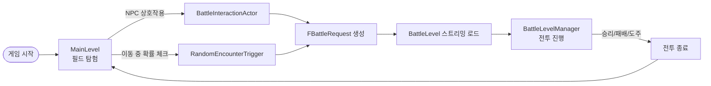
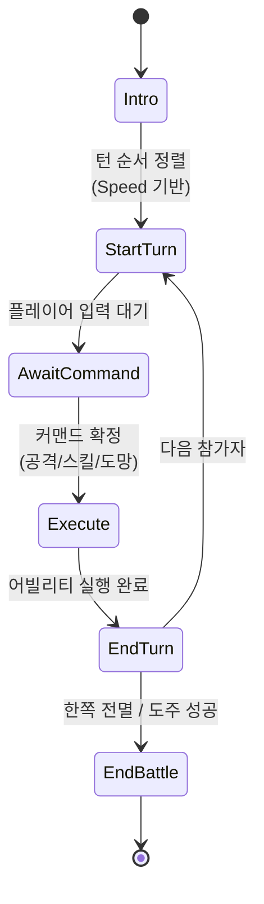
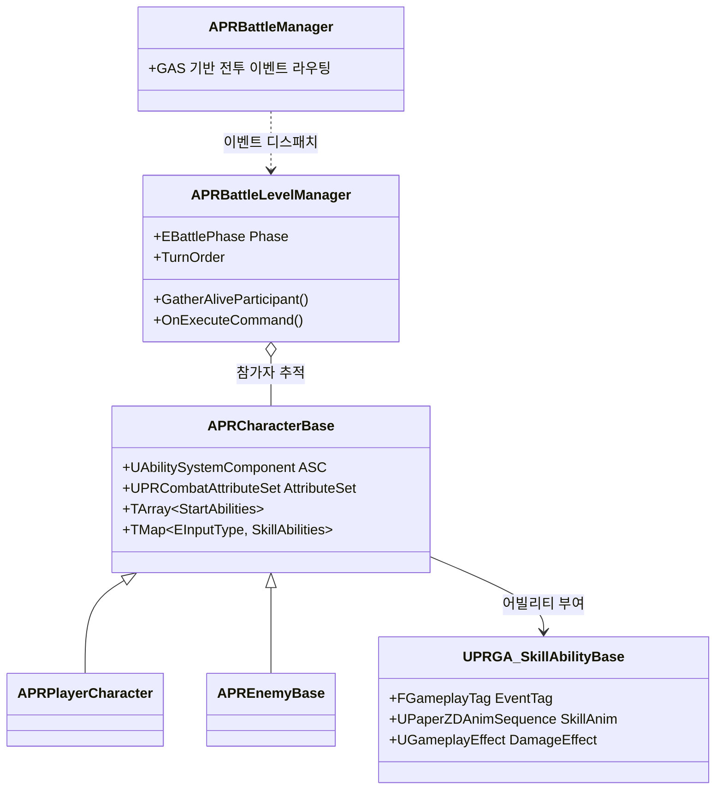

# PixelRPG

> Unreal Engine 5.6 기반 2D 픽셀 아트 턴제 RPG 프로젝트

PaperZD를 활용한 2D 스프라이트 캐릭터, GAS(Gameplay Ability System) 기반의 턴제 전투, 랜덤 인카운터, 어드벤처 필드 탐험을 결합한 RPG입니다. 모듈화된 C++ 아키텍처와 Enhanced Input, GameplayTag, DataTable/DataAsset을 적극적으로 활용하여 데이터 주도 설계(Data-Driven Design)를 지향했습니다.

<!-- TODO: 메인 게임플레이 GIF 또는 스크린샷 추가 -->
<!--  -->

---

## 목차

- [핵심 기능](#핵심-기능)
- [기술 스택](#기술-스택)
- [아키텍처 개요](#아키텍처-개요)
- [주요 시스템](#주요-시스템)
  - [전투 시스템 (Battle System)](#전투-시스템-battle-system)
  - [GAS 어빌리티 구성](#gas-어빌리티-구성)
  - [랜덤 인카운터](#랜덤-인카운터-random-encounter)
  - [상호작용 시스템](#상호작용-시스템-interaction)
  - [UI 시스템](#ui-시스템-umg)
- [프로젝트 구조](#프로젝트-구조)
- [크레딧](#크레딧)

---

## 핵심 기능

- 🗺️ **필드 탐험 → 전투 전환:** 메인 레벨에서 자유 탐험 중 NPC 상호작용 또는 랜덤 인카운터로 전투 레벨에 진입
- ⚔️ **턴제 전투:** Speed 어트리뷰트 기반 턴 순서 결정, GAS 어빌리티로 행동(공격/스킬/도망) 처리
- 🎯 **명령 선택 UI:** 공격·인벤토리·도망 슬롯과 스킬 선택, 타겟 지정까지 키보드 기반으로 구현
- 🎨 **2D 픽셀 아트:** PaperZD 기반 스프라이트 애니메이션 + AnimNotify 데미지 적용 타이밍 동기화
- 📦 **데이터 주도 설계:** 적 정보·전투 구성·스킬을 DataAsset/DataTable로 분리하여 콘텐츠 확장 용이

---

## 기술 스택

| 구분 | 내용 |
|------|------|
| **엔진** | Unreal Engine **5.6** |
| **언어** | C++ (3,800+ LOC), Blueprint |
| **2D 시스템** | Paper2D, **PaperZD** (스프라이트 애니메이션) |
| **게임플레이** | **GameplayAbilities (GAS)**, GameplayTags, GameplayTasks |
| **입력** | **Enhanced Input** |
| **UI** | UMG |
| **데이터** | DataTable, DataAsset, 구조체 기반 |

---

## 아키텍처 개요

### 게임 플로우



### 전투 페이즈 머신



### GAS 통합 구조



---

## 주요 시스템

### 전투 시스템 (Battle System)

`APRBattleLevelManager`가 전투의 페이즈 머신과 턴 순서를 관리합니다.

- **턴 순서:** `Speed` 어트리뷰트 + `TieRoll`로 정렬, `StableId`로 동률 처리
- **참가자 관리:** `IPRBattleInterface`(`GetSpeed()`, `IsAlive()`)로 플레이어/적 통합 추적
- **체력 모니터링:** 각 참가자의 ASC `Health` 어트리뷰트에 델리게이트 바인딩 → 사망 시 `SetAliveForActor(false)`
- **레벨 스트리밍:** `UPRAT_CreateBattleAndWait` 어빌리티 태스크가 BattleLevel을 비동기 로드하고, 플레이어 위치를 저장/복원

| 페이즈 | 설명 |
|--------|------|
| `Intro` | 전투 진입 연출 |
| `StartTurn` | 턴 순서 결정, 현재 액터 확정 |
| `AwaitCommand` | 플레이어 입력 대기 (UI 표시) |
| `Execute` | 어빌리티 실행, 애니메이션 재생 |
| `EndTurn` | 후처리, 다음 턴 결정 |
| `EndBattle` | 결과 처리 (Victory / Defeat / Runaway) |

### GAS 어빌리티 구성

전투 액션을 모두 `UGameplayAbility`로 모델링했습니다.

| 어빌리티 | 역할 |
|----------|------|
| `UPRGA_StartTurn` | 턴 시작, 커맨드 위젯 표시 |
| `UPRGA_Attack` | 기본 공격 진입점 |
| `UPRGA_CastSkill` | 선택된 스킬을 실제 스킬 어빌리티로 라우팅 |
| `UPRGA_DefaultAttack` | `UPRGA_SkillAbilityBase` 상속 - 기본 공격 구현 |
| `UPRGA_RunAway` | 도주 시도 |
| `UPRGA_CreateAssignBattle` / `CreateRandomBattle` | 전투 생성 |
| `UPRGA_EndBattle` | 전투 종료 정리 |

**어빌리티 태스크:**
- `UPRAT_PlaySequenceAndWait` — PaperZD 애니메이션 시퀀스 재생 후 완료/중단 콜백
- `UPRAT_CreateBattleAndWait` — 비동기 레벨 로드와 위치 저장/복원

**어트리뷰트 (`UPRCombatAttributeSet`):**
`Health`/`MaxHealth`, `Damage`/`MaxDamage`, `Speed`/`MaxSpeed` — `OnHealthChanged` 델리게이트로 HP 바·전투 매니저가 구독.

### 랜덤 인카운터 (Random Encounter)

`APRRandomEncounterTrigger`(`ATriggerBox` 상속)가 트리거 박스 안에서의 누적 이동 거리를 측정해 확률을 점진적으로 증가시킵니다.

```
StepPerIncrease 마다  →  ChancePerStepIncrease 만큼 확률 증가
CheckIntervalSeconds 마다 확률 체크
MaxEncounterChance 도달 시 상한
```

성공 시 `FBattleRequest`(BattleLevelName, EnemyGroupRowName, EnemyNumber 등)를 발행하여 전투를 개시합니다.

### 상호작용 시스템 (Interaction)

- `IPRInteractableInterface` — `Interact(AActor*)` 단일 메서드
- `UPRInteractionComponent` — 후보(Candidate) 액터를 큐로 관리, 가장 가까운 대상 선택
- `APRInteractionActorBase` — `UBoxComponent` 오버랩으로 후보 등록/해제
- `APRBattleInteractionActor` — 상호작용 시 전투 데이터(`UPRBattleDataAsset`)를 사용해 전투 개시
- `APRNonPlayerCharacterBase` — NPC 대화·전투 트리거를 모두 동일한 인터페이스로 처리

### UI 시스템 (UMG)

| 위젯 | 역할 |
|------|------|
| `UPRBattleCommandWidget` | 공격/인벤토리/도망 슬롯 메뉴 |
| `UPRBattleCommandSlotWidget` | 슬롯 베이스 클래스 - 선택 시각화·확정 처리 |
| `UPRAttackSlotWidget` | ASC에서 스킬 목록을 가져와 표시, **타겟 선택 모드** 지원 |
| `UPRAttackSkillSlotWidget` | 개별 스킬 슬롯 |
| `UPRRunAwaySlotWidget` | 도망 명령 |
| `UPRHPBarWidget` | ASC 어트리뷰트 변화 델리게이트 구독, 실시간 HP 반영 |

`APRPlayerController`의 `StartBattleUIMode` / `EndBattleUIMode`가 전투 진입/종료 시 UI 모드를 전환합니다.

---

## 프로젝트 구조

```
PRProject/
├── Config/                     # ini 설정 (GameplayTags, Input 등)
├── Content/
│   ├── PRProject/              # 자체 제작 에셋
│   │   ├── Abilities/          # GAS 어빌리티 BP
│   │   ├── Animation/          # PaperZD 애님 BP
│   │   ├── Battle/             # BattleManager BP
│   │   ├── Character/          # 캐릭터 BP
│   │   ├── Data/               # DataAsset, DataTable
│   │   ├── Input/              # Enhanced Input 액션
│   │   ├── Level/              # MainLevel, BattleLevel, TestLevel
│   │   └── UI/                 # UMG 위젯
│   └── AdventurePixel/         # 픽셀 아트 에셋팩 (외부)
└── Source/PRProject/
    ├── Ability/                # GAS 어빌리티 (+ Cue, SkillAbility, Task)
    ├── Animation/              # PaperZD AnimInstance, Notify
    ├── Attributes/             # AttributeSet
    ├── Battle/                 # BattleManager, BattleLevelManager
    ├── BattleTrigger/          # RandomEncounterTrigger
    ├── Character/              # CharacterBase, PlayerCharacter
    │   └── Components/         # InteractionComponent
    ├── Data/                   # BattleData, SkillData, BattleDataAsset
    ├── Enemy/                  # EnemyBase
    ├── Interaction/            # InteractionActorBase
    ├── Interface/              # 게임플레이 인터페이스 모음
    ├── NPC/                    # NonPlayerCharacterBase
    ├── Player/                 # PlayerController, PlayerState
    ├── Tag/                    # GameplayTag 정의
    └── UI/                     # UMG 위젯 클래스
```

**네이밍 컨벤션:**
- 클래스 접두사: `PR` (Player/Project) — 예: `APRPlayerCharacter`, `UPRCombatAttributeSet`
- GAS 어빌리티: `PRGA_` / 어빌리티 태스크: `PRAT_` / 게임플레이 큐: `PRGC_`

---

## 크레딧

- **2D 캐릭터 스프라이트:** [FREE Adventurer 2D Pixel Art](https://www.gamedevmarket.net/) (외부 에셋팩)
- **엔진 스타터 콘텐츠:** Epic Games — Unreal Engine 5 Starter Content
- **개발:** wonjin
